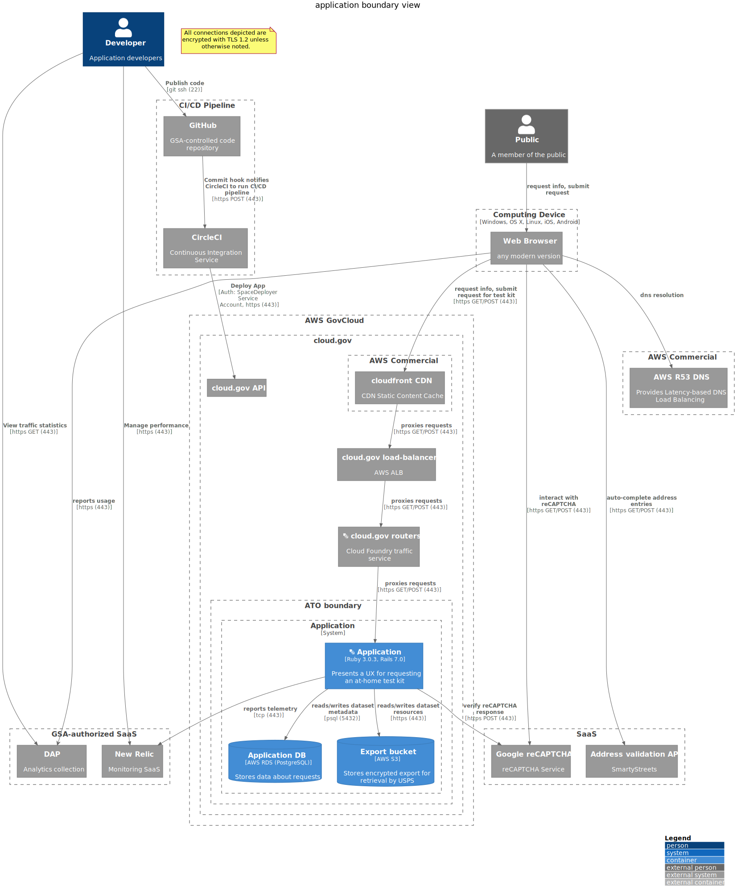

# Application boundary view



```plantuml
@startuml
!include https://raw.githubusercontent.com/plantuml-stdlib/C4-PlantUML/master/C4_Container.puml
' uncomment the following line and comment the first to use locally
' !include C4_Container.puml
LAYOUT_WITH_LEGEND()
title application boundary view

Person_Ext(public, "Public", "A member of the public")

Boundary(device, "Computing Device", "Windows, OS X, Linux, iOS, Android"){
    System_Ext(browser, "Web Browser", "any modern version")
}
Rel(public, browser, "request info, submit request", "")
Boundary(aws_com, "AWS Commercial") {
    System_Ext(r53, "AWS R53 DNS", "Provides Latency-based DNS Load Balancing")
}
Rel(browser, r53, "dns resolution")

note as EncryptionNote
All connections depicted are encrypted with TLS 1.2 unless otherwise noted.
end note
Boundary(aws, "AWS GovCloud") {
    Boundary(cloudgov, "cloud.gov") {
        System_Ext(cg_api, "cloud.gov API")
        Boundary(cg_aws_com, "AWS Commercial") {
            System_Ext(aws_cf, "cloudfront CDN", "CDN Static Content Cache")
        }
        System_Ext(aws_alb, "cloud.gov load-balancer", "AWS ALB")
        System_Ext(cloudgov_router, "<&layers> cloud.gov routers", "Cloud Foundry traffic service")
        Boundary(atob, "ATO boundary") {
            System_Boundary(inventory, "Application") {
                Container(app, "<&layers> Application", "Ruby 3.0.3, Rails 7.0", "Presents a UX for requesting an at-home test kit")
                ContainerDb(app_db, "Application DB", "AWS RDS (PostgreSQL)", "Stores data about requests")
                ContainerDb(app_s3, "Export bucket", "AWS S3", "Stores encrypted export for retrieval by USPS")
            }
        }
    }
}


Boundary(gsa_saas, "GSA-authorized SaaS") {
    System_Ext(dap, "DAP", "Analytics collection")
    System_Ext(newrelic, "New Relic", "Monitoring SaaS")
    System_Ext(recaptcha, "Google reCAPTCHA", "reCAPTCHA Service")
    System_Ext(address_api, "Address validation API", "SmartyStreets")
}
browser -> dap : **reports usage** \n//[https (443)]//
Rel(app, newrelic, "reports telemetry (ruby agent)", "tcp (443)")
Rel(browser, newrelic, "reports ux metrics (javascript agent)", "https (443)")
Rel(browser, aws_cf, "request info, submit request for test kit", "https GET/POST (443)")
Rel(aws_cf, aws_alb, "proxies requests", "https GET/POST (443)")
Rel(aws_alb, cloudgov_router, "proxies requests", "https GET/POST (443)")
Rel(cloudgov_router, app, "proxies requests", "https GET/POST (443)")
Rel(app, app_db, "reads/writes dataset metadata", "psql (5432)")
Rel(app, app_s3, "reads/writes dataset resources", "https (443)")

Rel(browser, address_api, "auto-complete address entries", "https GET/POST (443)")
Rel(browser, recaptcha, "interact with reCAPTCHA", "https GET/POST (443)")
Rel(app, recaptcha, "verify reCAPTCHA response", "https POST (443)")

Person(developer, "Developer", "Application developers")
Boundary(cicd, "CI/CD Pipeline") {
    System_Ext(github, "GitHub", "GSA-controlled code repository")
    System_Ext(circleci, "CircleCI", "Continuous Integration Service")
}
Rel(developer, github, "Publish code", "git ssh (22)")
Rel(github, circleci, "Commit hook notifies CircleCI to run CI/CD pipeline", "https POST (443)")
Rel(circleci, cg_api, "Deploy App", "Auth: SpaceDeployer Service Account, https (443)")
Rel(developer, dap, "View traffic statistics", "https GET (443)")
Rel(developer, newrelic, "Manage performance", "https (443)")


@enduml
```
