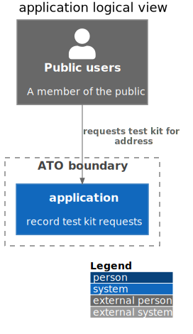

# application logical view



```plantuml
@startuml
!include https://raw.githubusercontent.com/plantuml-stdlib/C4-PlantUML/master/C4_Context.puml
LAYOUT_WITH_LEGEND()
title application logical view
Person_Ext(public, "Public users", "A member of the public")
Boundary(atob, "ATO boundary") {
    System(application, "application", "record test kit requests")
}
Rel(public, application, "requests test kit for address")
@enduml
```
