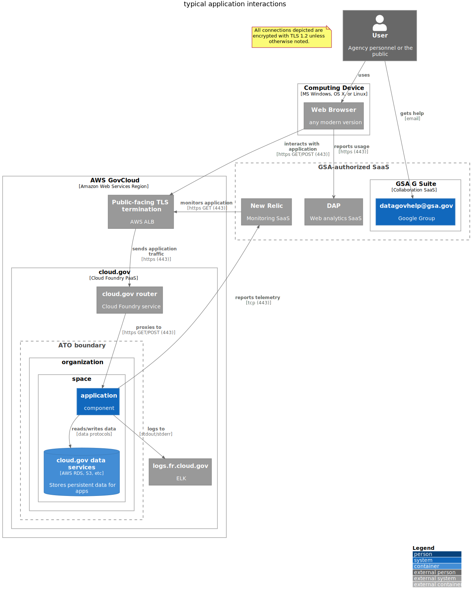

# Boundaries, components, and user interactions

Every component follows the pattern described below with variance only in the application or data services in use unless otherwise specified.


```plantuml
@startuml
!include https://raw.githubusercontent.com/plantuml-stdlib/C4-PlantUML/master/C4_Deployment.puml

LAYOUT_WITH_LEGEND()
title typical application interactions

note as EncryptionNote
  All connections depicted are encrypted with TLS 1.2 unless otherwise noted.
end note


Deployment_Node(aws, "AWS GovCloud", "Amazon Web Services Region") {
    System_Ext(aws_alb, "Public-facing TLS termination", "AWS ALB")
    Deployment_Node(cloudgov, "cloud.gov", "Cloud Foundry PaaS") {
        System_Ext(cloudgov_router, "cloud.gov router", "Cloud Foundry service")
        System_Ext(cloudgov_logdrain, "logs.fr.cloud.gov", "ELK")
        
        Boundary(atob, "ATO boundary") {
            Deployment_Node(organization, "organization") {
                Deployment_Node(space, "space") {
                    System(app, "application", "component")
                    ContainerDb(cloudgov_services, "cloud.gov data services", "AWS RDS, S3, etc", "Stores persistent data for apps")
                }
            }
        }
    }
}

Rel(aws_alb, cloudgov_router, "sends application traffic", "https (443)")
Rel_Down(app, cloudgov_services, "reads/writes data", "data protocols")


' Logs flow
Rel(app, cloudgov_logdrain, "logs to", "stdout/stderr")

' Customer access
Person_Ext(public, "User", "Agency personnel or the public")
Deployment_Node(computer, "Computing Device", "MS Windows, OS X, or Linux"){
    System_Ext(browser, "Web Browser", "any modern version")
}


' Monitoring
Boundary(gsa_saas, "GSA-authorized SaaS") { 
    Deployment_Node(gsuite, "GSA G Suite", "Collaboration SaaS") {
        System(ggroup, "datagovhelp@gsa.gov", "Google Group")
    }
    System_Ext(dap, "DAP", "Web analytics SaaS")
    System_Ext(newrelic, "New Relic", "Monitoring SaaS")
}

Rel(newrelic, aws_alb, "monitors application", "https GET (443)")
Rel(app, newrelic, "reports telemetry", "tcp (443)")
Rel(public, ggroup, "gets help", "email")
Rel(public, browser, "uses")
browser --> dap : **reports usage** \n//[https (443)]//

Rel(browser, aws_alb, "interacts with application", "https GET/POST (443)")
Rel(cloudgov_router, app, "proxies to", "https GET/POST (443)")

@enduml
```
