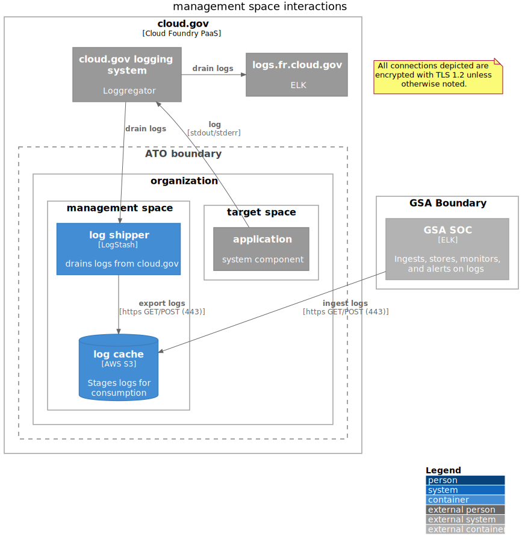

# management space



```plantuml
@startuml
!include https://raw.githubusercontent.com/plantuml-stdlib/C4-PlantUML/master/C4_Deployment.puml
LAYOUT_WITH_LEGEND()
title management space interactions
note as EncryptionNote
  All connections depicted are encrypted with TLS 1.2 unless otherwise noted.
end note
Deployment_Node(cloudgov, "cloud.gov", "Cloud Foundry PaaS") {
    System_Ext(cloudgov_loggregator, "cloud.gov logging system", "Loggregator")
    System_Ext(cloudgov_logs, "logs.fr.cloud.gov", "ELK")
    Boundary(atob, "ATO boundary") {
        Deployment_Node(organization, "organization") {
            Deployment_Node(management_space, "management space") {
                Container(log_drain, "log shipper", "LogStash", "drains logs from cloud.gov")
                ContainerDb(log_bucket, "log cache", "AWS S3", "Stages logs for consumption")
            }
            Deployment_Node(target_space, "target space") {
                System_Ext(target_app, "application", "system component")
            }
        }
    }
}

Deployment_Node(gsa_boundary, "GSA Boundary") {
    Container_Ext(gsa_soc, "GSA SOC", "ELK", "Ingests, stores, monitors, and   alerts on logs")
}

' Logging
Rel_Up(target_app, cloudgov_loggregator, "log", "stdout/stderr")

' The drains themselves also log, but this just gets confusing if we show it
'Rel_Up(management_drain, cloudgov_loggregator, "log", "stdout/stderr")

'Log draining
Rel_Down(cloudgov_loggregator, log_drain, "drain logs")
Rel_Right(cloudgov_loggregator, cloudgov_logs, "drain logs")

'Log shipping
Rel(log_drain, log_bucket, "export logs", "https GET/POST (443)")
Rel(gsa_soc, log_bucket, "ingest logs", "https GET/POST (443)")
@enduml
```
