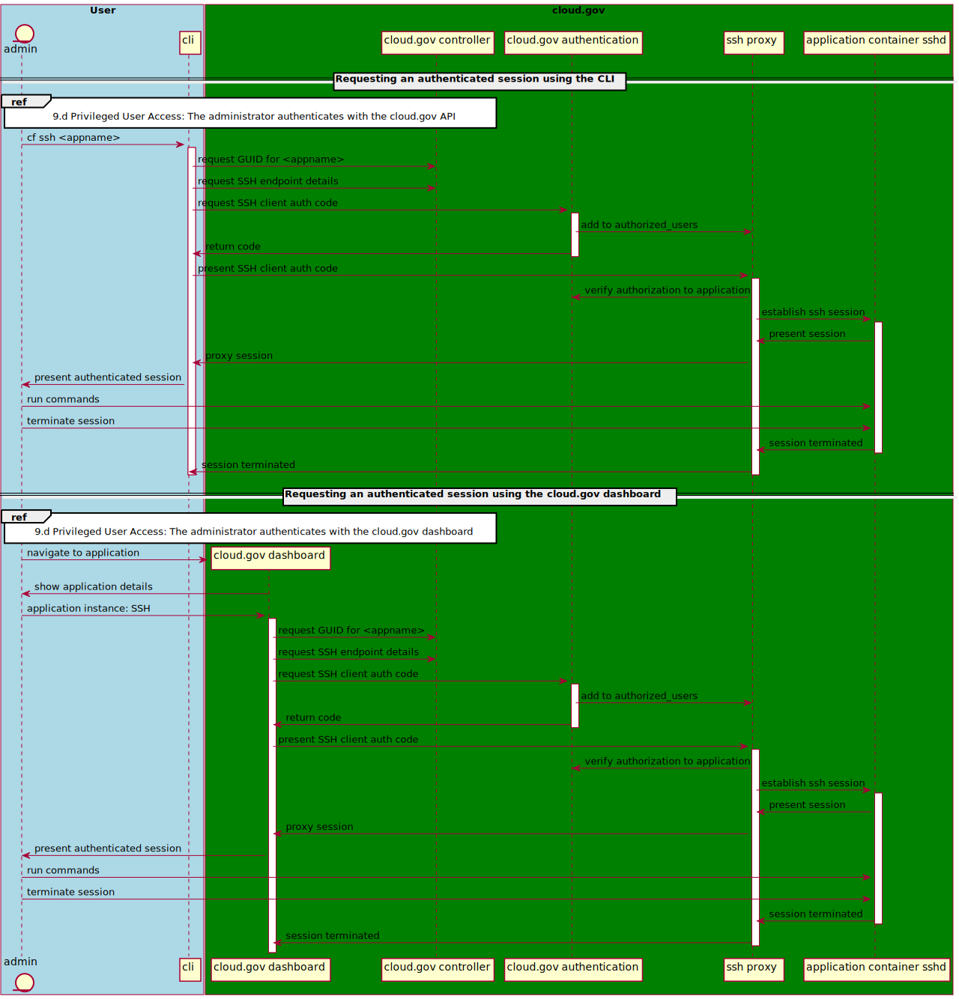
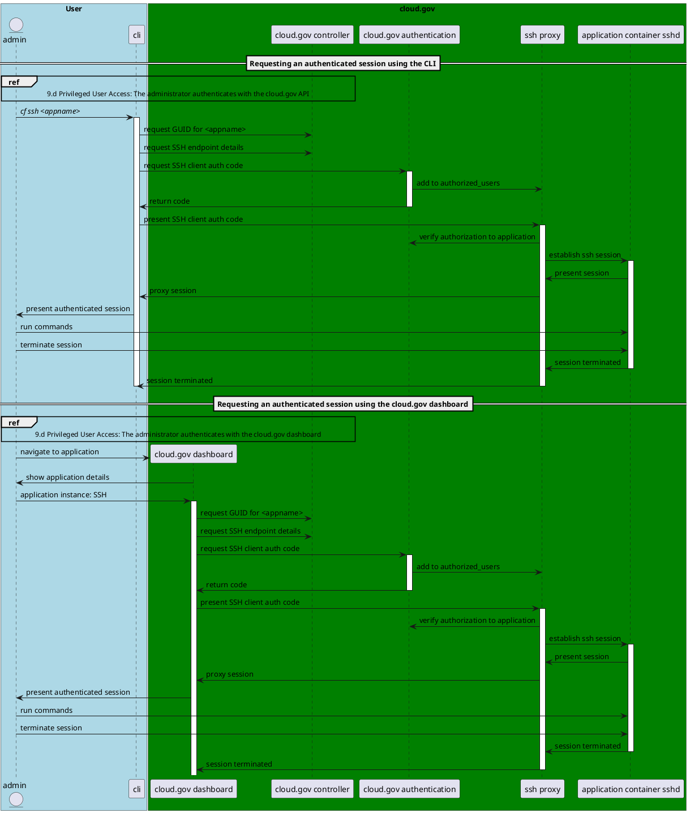

# Establishing a privileged session

The following interactions happen between cloud.gov systems when the team establishes an authenticated SSH session. See [the Cloud Foundry documentation on SSH](https://docs.cloudfoundry.org/devguide/deploy-apps/ssh-apps.html#other-ssh-access) for additional details if necessary.

