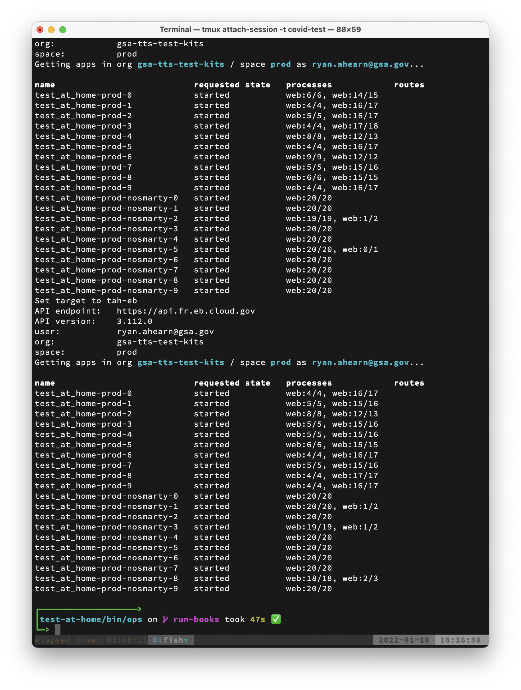
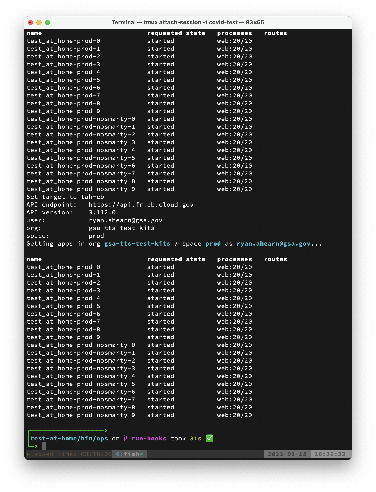

Run Book
========

Steps to address common issues. All scripts live in the `bin/ops` folder unless otherwise specified.

Ensure that you broadcast your intent to run any of these scripts in [#tts-covidtest-situation](https://gsa-tts.slack.com/archives/C02UHU3DRH6)

* [Take the site off the internet](#take-down-the-site)
* [Bring the site back up](#bring-up-the-site)
* [Switch live configurations](#switch-configurations)

## Multiple Configurations Background

In production, there are two configurations running simultaneously.

1. `prod` which has all features enabled
1. `prod-nosmarty` which has address validation with SmartyStreets disabled

`prod` is the main configuration, but if we start to see failures attributable to SmartyStreets having issues, we should swap the active configuration in use to `prod-nosmarty`.

##  Take Down The Site

Use these steps to make the site inaccessible, quickly.

#### The "Normal" configuration was active

1. Run `toggle-prod-routes -d prod`
1. Run `cf-list-apps` to verify that no routes are listed next to any apps
1. Update `.circleci/config.yml` to include `--no-route` on each `EXTRA_DEPLOY_ARGS` for the `prod` apps (4 lines to update)
  * This change should be merged to main, but doesn't need to be deployed. It's just there to ensure a future deploy does not undo what the script accomplished

**Note:** If any deploys were in progress when bringing down the site, run `cf-list-apps` to verify that the deploy has completed and that no apps are now accidentally accessible by any routes. See the [Bring Up The Site](#bring-up-the-site) section for instructions on verifying the deploy. If any real routes (ending in `covidtest.usa.gov`) are still present re-run `toggle-prod-routes -d prod`. If any default routes (ending in `cloud.gov`) have been applied, run `unmap-default-routes`

#### The "No SmartyStreets" configuration was active

1. Run `toggle-prod-routes -d prod-nosmarty`
1. Run `cf-list-apps` to verify that no routes are listed next to any apps
1. Update `.circleci/config.yml` to include `--no-route` on each `EXTRA_DEPLOY_ARGS` for the `prod-nosmarty` apps (4 lines to update)
  * This change should be merged to main, but doesn't need to be deployed. It's just there to ensure a future deploy does not undo what the script accomplished

**Note:** If any deploys were in progress when bringing down the site, run `cf-list-apps` to verify that the deploy has completed and that no apps are now accidentally accessible by any routes. See the [Bring Up The Site](#bring-up-the-site) section for instructions on verifying the deploy. If any real routes (ending in `covidtest.usa.gov`) are still present re-run `toggle-prod-routes -d prod-nosmarty`. If any default routes (ending in `cloud.gov`) have been applied, run `unmap-default-routes`

##  Bring Up The Site

#### The "Normal" configuration should be active

1. Verify that any recent deploys have completed by running `cf-list-apps`
  * Example output after deploy started: 
  * [Example output after the main app has completed](./screenshots/mid_deploy.png)
  * Example output after deploy is fully complete: 
1. Run `toggle-prod-routes -e prod`
1. Update `.circleci/config.yml` to remove `--no-route` on each `EXTRA_DEPLOY_ARGS` for the `prod` apps (4 lines to update)
  * This change should be merged to main, but doesn't need to be deployed. It's just there to ensure a future deploy does not undo what the script accomplished

#### The "No SmartyStreets" configuration should be active

1. Verify that any recent deploys have completed by running `cf-list-apps`
  * See normal configuration instructions for screenshots. Deploy absolutely must be fully complete for this case
1. Run `toggle-prod-routes -e prod-nosmarty`
1. Update `.circleci/config.yml` to remove `--no-route` on each `EXTRA_DEPLOY_ARGS` for the `prod-nosmarty` apps (4 lines to update)
  * This change should be merged to main, but doesn't need to be deployed. It's just there to ensure a future deploy does not undo what the script accomplished

##  Switch Configurations

This section should be used to quickly disable SmartyStreets integration, or to re-enable it after it/we have recovered and traffic is lower.

#### Disable SmartyStreets

1. Verify that any recent deploys have completed by running `cf-list-apps`
  * [Example output after deploy is fully complete](./screenshots/deploy_complete.png)
1. Run `toggle-prod-routes -e prod-nosmarty -d prod`
1. Request a CloudFront cache invalidation from either the cloud.gov engineer on-call with you or the Slack [#cg-support channel](https://gsa-tts.slack.com/archives/C09CR1Q9Z). Tag `@cg-operators` in that case. They'll need to invalidate the following routes:
  * `/`
  * `/en`
  * `/es`
  * `/zh`
1. Update `.circleci/config.yml` to add `--no-route` on each `EXTRA_DEPLOY_ARGS` for the `prod` apps (4 lines) and  remove `--no-route` on each `EXTRA_DEPLOY_ARGS` for the `prod-nosmarty` apps (4 lines)
  * This change should be merged to main, but doesn't need to be deployed. It's just there to ensure a future deploy does not undo what the script accomplished

#### Enable SmartyStreets

1. Verify that any recent deploys have completed by running `cf-list-apps`
  * [Example output after prod deploy is complete](./screenshots/mid_deploy.png)
1. Run `toggle-prod-routes -d prod-nosmarty -e prod`
1. Request a CloudFront cache invalidation from either the cloud.gov engineer on-call with you or the Slack [#cg-support channel](https://gsa-tts.slack.com/archives/C09CR1Q9Z). Tag `@cg-operators` in that case. They'll need to invalidate the following routes:
  * `/`
  * `/en`
  * `/es`
  * `/zh`
1. Update `.circleci/config.yml` to add `--no-route` on each `EXTRA_DEPLOY_ARGS` for the `prod` apps (4 lines) and  remove `--no-route` on each `EXTRA_DEPLOY_ARGS` for the `prod-nosmarty` apps (4 lines)
  * This change should be merged to main, but doesn't need to be deployed. It's just there to ensure a future deploy does not undo what the script accomplished

## Deploying a code change

TKTK
